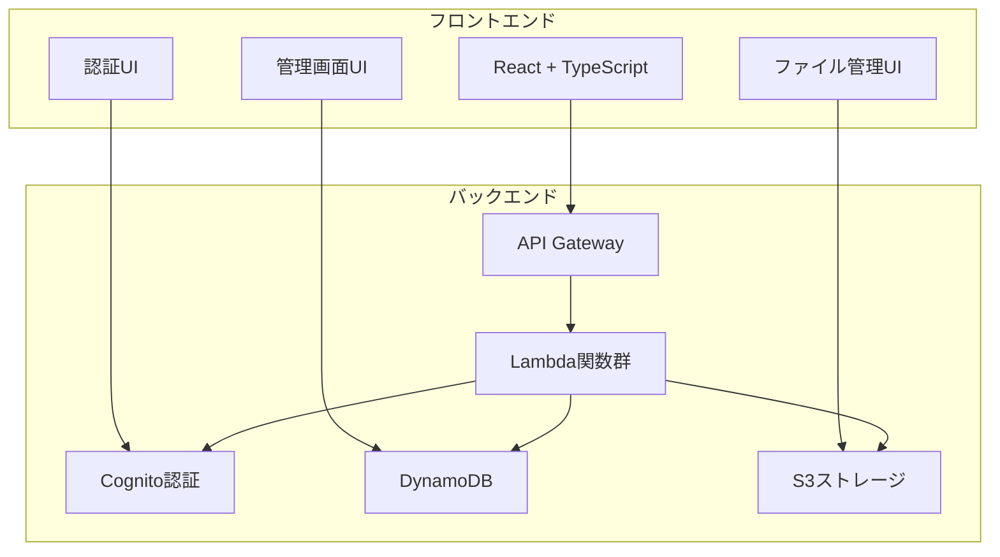

# ファイル管理アプリを作ろうと思った話

## 概要

ドキュメント管理アプリケーションの開発プロジェクトにおける要件定義と技術選定のプロセスを記録する。社員番号による認証、階層フォルダ管理、バージョン管理機能を持つエンタープライズ向けファイル管理システムの設計方針と、AWS Amplify Gen2を技術基盤として選択した判断根拠を整理する。

## 実装内容

### アプリケーション要件の整理

ファイル管理アプリケーションに求められる機能を以下の優先度で整理した：

**Phase 1: 基盤機能**
- 社員番号による認証システム
- 管理者・一般ユーザーの権限管理
- 基本的なファイルアップロード・ダウンロード

**Phase 2: コア機能**
- 階層フォルダ管理
- ファイルのバージョン管理
- タイトル管理とロック機能

**Phase 3: 拡張機能**
- 動的ロール管理
- 権限マトリクス設定
- 検索・プレビュー機能

### システムアーキテクチャの初期設計

以下の図は、設計したシステム全体のアーキテクチャを示している：

この構成では、認証・データ管理・ファイルストレージが分離され、各コンポーネントが独立してスケールできる設計となっている。

### 技術スタック選定の検討

複数の技術選択肢を比較検討した結果を以下に示す：

| 項目 | AWS Amplify Gen2 | Firebase | 自前構築 |
|------|------------------|----------|----------|
| 開発速度 | ◎ | ◎ | △ |
| 認証機能 | ◎ (Cognito) | ◎ | △ |
| ファイル管理 | ◎ (S3) | ○ | △ |
| 権限管理 | ◎ | ○ | ◎ |
| 運用コスト | ○ | ○ | △ |
| 学習コスト | ○ | ◎ | △ |

**Amplify Gen2選択の決定要因：**
1. エンタープライズレベルの認証機能（Cognito）
2. S3による堅牢なファイルストレージ
3. サーバーレスアーキテクチャによる運用負荷軽減
4. IAMによる細かい権限制御

## 遭遇した問題

### 要件定義段階での課題

**問題1: 権限管理の複雑性**
当初、単純な管理者・一般ユーザーの2段階権限を想定していたが、実際の運用を考慮すると以下の課題が判明した：
- フォルダごとの読み取り・書き込み権限制御
- 部署横断的なプロジェクトでの権限共有
- 一時的な権限付与の仕組み

**問題2: バージョン管理の設計複雑性**
ファイルのバージョン管理において、以下の技術的課題が浮上した：
- ファイル名変更時のバージョン履歴継承
- 大容量ファイルの効率的なバージョン保存
- バージョン間の差分表示機能

## 解決アプローチ

### 段階的開発戦略の採用

複雑な要件に対して、以下の段階的アプローチを採用した：

1. **MVP（最小実行可能製品）の定義**
   - 基本的なファイル操作のみに機能を限定
   - 認証は社員番号ログインのみ実装
   - 権限は管理者・一般ユーザーの2段階のみ

2. **段階的機能拡張**
   - Phase 1完了後にユーザーフィードバックを収集
   - 実際の利用パターンに基づいて要件を再評価
   - 必要性が確認された機能から順次実装

### 技術的制約の事前調査

Amplify Gen2の技術的制約を事前に調査し、以下の点を確認した：

- **認証機能**: Cognitoカスタム属性による社員番号管理の可否
- **ファイル管理**: S3の権限制御とAmplify Storageの統合方法
- **データベース**: DynamoDBのクエリパフォーマンスと設計制約

## 最終的な解決策

### 要件の優先度付けと段階的実装

以下の基準で要件を整理し、実装順序を決定した：

**優先度1（必須機能）:**
- 社員番号認証
- 基本的なファイル操作
- 管理者権限

**優先度2（重要機能）:**
- フォルダ階層管理
- バージョン管理
- ユーザー管理

**優先度3（拡張機能）:**
- 動的ロール管理
- 権限マトリクス
- 検索・プレビュー

### アーキテクチャ設計原則の確立

以下の設計原則を確立し、一貫した開発方針とした：

1. **セキュリティファースト**: 認証・認可をすべての機能の前提とする
2. **スケーラビリティ**: 将来の機能拡張を考慮した疎結合設計
3. **運用性**: ログ・監視・バックアップを設計段階から考慮
4. **保守性**: コードの可読性と再利用性を重視

## 学んだこと

### 要件定義における重要な観点

**技術選定前の要件整理の重要性**
技術スタックを選択する前に、以下の観点で要件を整理することが重要であることが判明した：
- 非機能要件（パフォーマンス、セキュリティ、可用性）の明確化
- 将来の拡張性要件の事前検討
- 運用・保守要件の具体化

**段階的開発の有効性**
すべての機能を一度に実装するのではなく、段階的にリリースすることで以下のメリットが得られることを確認した：
- 早期のユーザーフィードバック取得
- 技術的リスクの分散
- 開発チームの学習効果

### 技術選定における判断基準

**学習コストと開発速度のバランス**
新しい技術スタック（Amplify Gen2）を選択する際、以下の要素を総合的に評価することが重要であった：
- 公式ドキュメントの充実度
- コミュニティの活発さ
- 既存の技術スキルとの親和性

**ベンダーロックインのリスク評価**
AWS特化のソリューションを選択する際、以下のリスク軽減策を検討した：
- データエクスポート機能の確保
- 標準的なAPIの活用
- 移行可能性の事前検証

## 次回予告

次回は、Amplify Gen2を使用した開発環境の構築プロセスを記録する。Node.js環境の設定、Amplify CLIのセットアップ、そして最初に遭遇する循環参照エラーの問題について詳述する予定である。特に、日本語環境特有の問題と、AI開発支援ツールとの効率的な連携方法についても触れる。