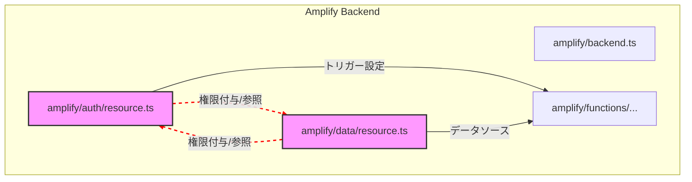

## 概要
前回の第1話では、Amplify Gen2を使って認証基盤を構築し、`react-router-dom`でルーティングの土台を作りました。今回は、その次のステップで直面した、開発を一時停止に追い込んだ二つの大きな問題について深掘りします。一つはAmplify Gen2特有の「循環参照エラー」、もう一つは開発環境の「Node.jsバージョン問題」です。これらの原因と、解決までの悪戦苦闘の記録を共有します。

## 実装内容
開発を進める中で、ユーザー認証（`auth`リソース）とデータ管理（`data`リソース）の連携が必要になりました。例えば、ユーザーがログインした後に、そのユーザー情報に基づいて特定のデータにアクセスする、といった機能です。

当初は、`amplify/auth/resource.ts`と`amplify/data/resource.ts`の間で、それぞれのリソースが互いのLambda関数やテーブルにアクセスできるよう、権限を付与する設定を試みました。

## 遭遇した問題
### 1. 開発を止めた「循環参照エラー」
Amplify Gen2で`npx amplify sandbox`を実行し、バックエンドをデプロイしようとした際、`CloudformationStackCircularDependencyError`というエラーに遭遇しました。

これは、AWS CloudFormationというインフラ管理サービスが、リソース間の依存関係を解決できない場合に発生するエラーです。例えるなら、「AはBが必要、BはAが必要」という無限ループに陥ってしまい、どちらから先に作ればいいか分からなくなる状態です。

私の場合は、`auth`リソース（Cognito）と`data`リソース（AppSync/DynamoDB）の間で、Lambda関数の定義や権限付与が複雑に絡み合い、お互いを参照し合うような構造になっていたことが原因でした。



この図のように、`auth`と`data`がお互いを直接参照し合うことで、CloudFormationがスタックを構築できなくなっていたのです。

### 2. Node.jsバージョンの罠
循環参照エラーと格闘する中で、別の不可解なビルドエラーが頻発しました。AmplifyのバックエンドがTypeScriptコードをJavaScriptに変換する際に、依存ライブラリのコンパイルに失敗する、といった内容です。

当初はコードの記述ミスを疑っていましたが、AIアシスタントとの対話を通じて、開発環境のNode.jsバージョンが原因である可能性が浮上しました。

私の環境ではNode.js `v22.x`（当時最新のCurrent版）を使用していましたが、Amplify Gen2はLTS（長期サポート）版である`v18.x`や`v20.x`を前提に構築されており、最新版では互換性の問題が発生することが判明しました。（※Node.js v20のサポートは2026年4月30日で終了するため、将来的なアップグレードも視野に入れる必要があります）

さらに、Node.jsのバージョン管理ツール`nvm-windows`を導入しようとした際、Windowsのユーザー名に日本語（例: `C:\Users\[ユーザー名]`）が含まれていると、`nvm`が正常に動作しないという問題にも直面しました。

## 解決アプローチ
### 1. 循環参照エラーの解決
AIアシスタントからの提案と、Amplify Gen2のドキュメントを読み解く中で、以下の原則にたどり着きました。

*   **リソース定義の完全分離**: 各Lambda関数は`amplify/functions/`配下に独立したリソースとして定義し、`amplify/auth/resource.ts`や`amplify/data/resource.ts`は、それらの関数を「関連付けるだけ」の役割に徹する。
*   **`backend.ts`を司令塔とする**: `amplify/backend.ts`をバックエンド全体の司令塔とし、ここで`auth`リソースと`data`リソースをインポートし、リソース間の権限付与は`backend.ts`内で`.addToRolePolicy()`メソッドを使って直接IAMポリシーをアタッチする。これにより、依存関係を単方向に保ちます。
*   **`defineData`の簡素化**: `amplify/data/resource.ts`の`defineData`の引数から`authorizationModes`プロパティを**完全に省略**する。`backend.ts`で`auth`と`data`の両方が登録されていれば、Amplifyが自動的に`auth`リソースのUserPoolを`data`リソースに関連付けてくれるため、余計な設定は不要でした。

### 2. Node.jsバージョン問題の解決
*   **`nvm-windows`の導入**: Node.jsのバージョンを柔軟に切り替えるため、`nvm-windows`を導入しました。
*   **日本語パス問題の回避**: `nvm-windows`のインストール先を`C:\nvm`のような日本語を含まないパスに変更し、環境変数を正しく設定することで、`nvm`コマンドが正常に動作するようにしました。
*   **LTS版へのダウングレード**: `nvm`を使ってNode.jsのバージョンをAmplify Gen2が推奨する安定版である`v20.x`に設定しました。

## 最終的な解決策
これらのアプローチを組み合わせることで、長期間にわたって開発を妨げていたエラーを最終的に解決することができました。

### `amplify/backend.ts`での権限付与の例
`backend.ts`で、各Lambda関数（例: `inviteUserFunction`）の実行ロールに、必要なAWSサービス（CognitoやDynamoDB）へのアクセス権限を直接付与します。

```typescript
// amplify/backend.ts (抜粋)
import { defineBackend } from '@aws-amplify/backend';
import { Effect, PolicyStatement } from 'aws-cdk-lib/aws-iam';
// ... その他のインポート

export const backend = defineBackend({
  auth,
  data,
  storage,
  inviteUserFunction, // Lambda関数をbackendに登録
  // ... その他のLambda関数
});

// ... API Gatewayの定義など

// --- Function: inviteUserFunction の設定 ---
// Lambda関数がCognito User Poolを操作するための権限を付与
backend.inviteUserFunction.resources.lambda.addToRolePolicy(
 new PolicyStatement({
   effect: Effect.ALLOW,
   actions: ['cognito-idp:AdminCreateUser', 'cognito-idp:AdminAddUserToGroup', 'cognito-idp:AdminSetUserPassword'],
   resources: [userPoolArn], // userPoolArnはbackend.auth.resources.userPool.userPoolArnから取得
 })
);
// Lambda関数がDynamoDBのUserテーブルを操作するための権限を付与
backend.inviteUserFunction.resources.lambda.addToRolePolicy(
 new PolicyStatement({
   effect: Effect.ALLOW,
   actions: ['dynamodb:PutItem'],
   resources: [userTableArn], // userTableArnはbackend.data.resources.tables.User.tableArnから取得
 })
);
```

この方法により、authとdataリソースが直接お互いの権限を定義し合うことを避け、backend.tsが中央集権的に権限を管理する形になりました。 
また、amplify/data/resource.tsでは、defineDataのauthorizationModesを省略し、スキーマ定義に集中させました。

```typescript
// amplify/data/resource.ts (抜粋)
import { type ClientSchema, a, defineData } from '@aws-amplify/backend';
// ... スキーマ定義
const schema = a.schema({
  User: a.model({ /* ... */ }),
  Folder: a.model({ /* ... */ }),
  // ... その他のモデル
});
export type Schema = ClientSchema<typeof schema>;
export const data = defineData({
  schema,
  // authorizationModesはbackend.tsでauthとdataが登録されていれば自動で関連付けられるため、ここでは省略
});
```
そして、package.jsonのenginesフィールドでNode.jsの推奨バージョンを指定し、開発環境をv20.xに統一しました。

```json
// package.json (抜粋)
{
  "name": "document-manager",
  // ...
  "engines": {
    "node": ">=20.0.0", // Node.js v20.x以上を推奨
    "npm": ">=10.0.0"
  }
}
```

学んだこと
この一連のトラブルシューティングを通じて、以下の重要な教訓を得ました。

*   **エラーメッセージの深掘り**: `CloudformationStackCircularDependencyError`のような抽象的なエラーも、その背後にある依存関係を一つずつ紐解くことで、根本原因にたどり着けることを学びました。
*   **開発環境の整備の重要性**: 最新版だからといって安易にNode.jsのバージョンを上げると、フレームワークとの互換性問題で予期せぬエラーに遭遇する可能性があります。フレームワークが推奨するLTS版を使用し、`nvm`のようなツールでバージョンを管理することの重要性を痛感しました。
*   **Amplify Gen2のベストプラクティス**: リソース定義の分離、`backend.ts`を司令塔とした権限管理、`defineData`の簡素化といった、Amplify Gen2のアーキテクチャにおけるベストプラクティスを実践的に学ぶことができました。
*   **日本語パス問題**: Windows環境で開発を行う場合、ユーザー名に日本語が含まれるパスが原因でツールが正常に動作しないケースがあることを認識し、回避策を講じることの重要性を学びました。

## 次回予告
これらの大きな壁を乗り越え、ようやく安定した開発基盤が整いました。次回は、ビジネスアプリに必須となる「社員番号でのログイン機能」を、Amplify Gen2とAWSのサービスを組み合わせてどのように実現したのか、その詳細を掘り下げていきます。