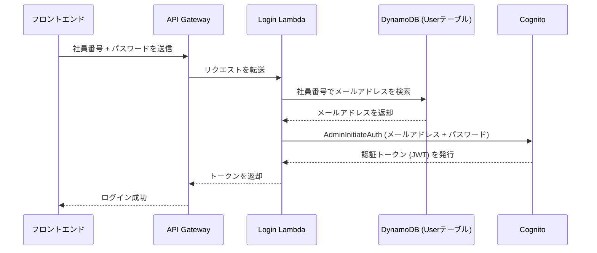

## 概要
前回の第2話では、循環参照エラーやNode.jsのバージョン問題といった「開発環境の土台」を整える過程をお伝えしました。基盤が安定したところで、次に取り組んだのは実用的なアプリケーションには欠かせない「認証機能のカスタマイズ」です。

一般的なWebサービスはメールアドレスでのログインが主流ですが、社内システムでは「社員番号（ユーザーID）」でログインしたいというニーズが非常に高いです。今回は、Amplify Gen2とAWS Lambda、API Gatewayを組み合わせ、社員番号によるログインを実現した過程をレポートします。

## 実装内容
社員番号ログインを実現するために、以下の3つのステップで構築を進めました。

### 1. Cognitoカスタム属性の定義
まず、ユーザー情報（AWS Cognito User Pool）に社員番号を保存するための場所を作る必要があります。`amplify/auth/resource.ts` で `custom:employeeId` というカスタム属性を定義しました。

```typescript
// amplify/auth/resource.ts
import { defineAuth } from '@aws-amplify/backend';

export const auth = defineAuth({
  loginWith: {
    email: true, // 標準のメールアドレス認証も有効にしておく
  },
  userAttributes: {
    // 社員番号を保存するためのカスタム属性
    'custom:employeeId': {
      dataType: 'String',
      mutable: true,
    },
  },
  groups: ['Admins', 'Users'],
});
```

### 2. カスタムログインLambdaハンドラーの実装
標準の `signIn` 関数では社員番号を直接扱うことが難しいため、独自にログイン処理を行うLambda関数 `login-with-employee-id` を作成しました。

この関数の主な役割は以下の通りです：
1. DynamoDBの `User` テーブルを社員番号で検索し、対応するメールアドレスを取得する。
2. 取得したメールアドレスとパスワードを使い、Cognitoの `AdminInitiateAuth` APIを呼び出して認証を実行する。

```typescript
// amplify/functions/login-with-employee-id/handler.ts (抜粋)
export const handler = async (event: APIGatewayProxyEvent): Promise<APIGatewayProxyResult> => {
  // ... 前処理 ...
  const { employeeId, password } = JSON.parse(event.body);

  // 1. DynamoDBからメールアドレスを検索
  const queryCommand = new QueryCommand({
    TableName: USER_TABLE_NAME,
    IndexName: 'byEmployeeId',
    KeyConditionExpression: 'employeeId = :employeeId',
    ExpressionAttributeValues: { ':employeeId': { S: employeeId } },
    ProjectionExpression: 'email',
  });
  const { Items } = await ddbClient.send(queryCommand);
  const email = unmarshall(Items[0]).email;

  // 2. Cognitoで認証を実行
  const authCommand = new AdminInitiateAuthCommand({
    AuthFlow: AuthFlowType.ADMIN_USER_PASSWORD_AUTH,
    ClientId: USER_POOL_CLIENT_ID,
    UserPoolId: USER_POOL_ID,
    AuthParameters: { USERNAME: email, PASSWORD: password },
  });
  const authResult = await cognitoClient.send(authCommand);

  return {
    statusCode: 200,
    headers: corsHeaders,
    body: JSON.stringify({ AuthenticationResult: authResult.AuthenticationResult }),
  };
};
```

### 3. API Gatewayの設定
フロントエンドからこのLambda関数を呼び出せるように、`amplify/backend.ts` でAPI Gatewayのエンドポイントを設定しました。

```typescript
// amplify/backend.ts (抜粋)
const api = new RestApi(backend.stack, 'DocumentManagerUserApi', {
  defaultCorsPreflightOptions: {
    allowOrigins: ['*'],
    allowMethods: ['POST', 'OPTIONS'],
  },
});

const loginResource = api.root.addResource('login');
loginResource.addMethod('POST', new LambdaIntegration(backend.loginWithEmployeeIdFunction.resources.lambda));
```

## 遭遇した問題
実装の過程で、非常に厄介な2つの問題に直面しました。

### 1. 属性変更の不可制約
一度デプロイしたCognitoのカスタム属性は、名前の変更や削除ができないという制約があります。開発の途中で属性名を `custom:employee_id`（アンダースコア）から `custom:employeeId`（キャメルケース）に変更しようとした際、以下のエラーが発生してデプロイが止まってしまいました。

> `CloudFormationDeploymentError: Existing schema attributes cannot be modified or deleted.`

### 2. preAuthentication Lambdaトリガーの限界
当初はAmplifyの標準認証フローに割り込む `preAuthentication` トリガーでの実装を試みましたが、このトリガー内ではユーザーの認証情報を完全に書き換えて続行させることが難しく、フロントエンド側での複雑な条件分岐が必要になることが分かりました。

## 解決アプローチ
「標準機能の中でなんとかする」という考えから一度離れ、よりシンプルで堅牢なアーキテクチャへの転換を図りました。

### 1. サンドボックスの強制リセット
Cognitoの属性エラーについては、本番環境では許されませんが、開発段階であれば環境を作り直すのが最も確実です。
以下のコマンドで一度クラウド上のリソースを完全に削除し、正しい定義で再構築を行いました。

```bash
npx amplify sandbox delete
```

### 2. 独自API（API Gateway + Lambda）方式への転換
`preAuthentication` トリガーに依存せず、独自のログイン用エンドポイント（`/login`）を作成する方針に切り替えました。
これにより：
- 認証フローがブラックボックス化せず、挙動を100%制御できる。
- 社員番号からメールアドレスへの変換ロジックをバックエンドに完全に隠蔽できる。
- フロントエンドは単純にAPIを叩くだけになり、コードがシンプルになる。

## 最終的な解決策
最終的に、以下の構成で社員番号ログインを安定して動作させることができました。

1. **不変のID設計**: `custom:employeeId` を確定させ、DynamoDBの `User` テーブルにGSI（グローバルセカンダリインデックス）を設定して高速な検索を可能にしました。
2. **管理者認証フローの有効化**: `AdminInitiateAuth` を使用するため、`backend.ts` でApp Clientの設定をオーバーライドしました。

```typescript
// amplify/backend.ts でのオーバーライド例
backend.auth.resources.cfnResources.cfnUserPoolClient.addPropertyOverride(
  'ExplicitAuthFlows',
  [
    'ALLOW_ADMIN_USER_PASSWORD_AUTH',
    'ALLOW_REFRESH_TOKEN_AUTH',
    'ALLOW_USER_SRP_AUTH'
  ]
);
```

3. **フロントエンドのUI改修**: ログイン画面のラベルを「ユーザーID」に変更し、入力された値をカスタムAPIへ送信するようにしました。



## 学んだこと
- **マネージドサービスの制約を知る**: Cognitoの属性変更不可のように、クラウドサービス特有の制約を早期に把握しておくことの重要性を学びました。
- **「標準」にこだわりすぎない**: フレームワークが提供する標準機能で実現が難しい場合、AWSの他のサービス（Lambda, API Gateway等）を組み合わせることで、よりシンプルでメンテナンス性の高い解決策が見つかることがあります。
- **破壊的変更の勇気**: 開発初期であれば、`sandbox delete` で環境をリセットしてやり直すことが、結果として最短ルートになる場合があります。

## 次回予告
認証機能が完成し、ようやくユーザーがログインできるようになりました。次回は、ログインしたユーザーの情報をどのように管理し、DynamoDBとCognitoの間でデータをどのように同期させているのか、その裏側の「ユーザー管理システム」の設計について詳しくお話しします。

