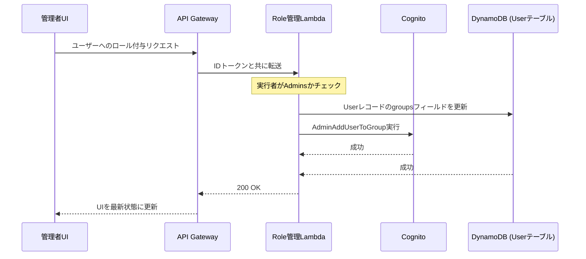

## 概要
第4話では、ユーザー情報を管理する仕組みを構築しました。しかし、企業向けアプリとして運用するには、「ログインできること」の次に「誰がどの操作を許可されるか」を厳密に制御する必要があります。

例えば、一般ユーザーにはドキュメントの閲覧のみを許可し、管理者（Admins）のみがユーザーの招待やフォルダの削除を行えるようにするといった制御です。今回は、AWS Amplify Gen2環境において、CognitoグループとDynamoDBを組み合わせた「役割ベースのアクセス制御（RBAC）」をどのように実装したかを解説します。

## 実装内容

### 1. Cognitoグループによる役割定義
まず、認証基盤であるCognitoに「Admins（管理者）」と「Users（一般ユーザー）」というグループを定義しました。Amplify Gen2では、`amplify/auth/resource.ts` でこれらを宣言的に記述できます。

```typescript
// amplify/auth/resource.ts
import { defineAuth } from '@aws-amplify/backend';

export const auth = defineAuth({
  loginWith: { email: true },
  // アプリケーションで使用する初期ロールを定義
  groups: ['Admins', 'Users', '設計', '品証', '営業'],
});
```

### 2. 権限マトリクスのデータ設計
「どの役割が」「どのフォルダに対して」「どの権限（閲覧/編集/管理）を持つか」を動的に管理するため、DynamoDBに `Permission` モデルを作成しました。

```typescript
// amplify/data/resource.ts
const schema = a.schema({
  Permission: a.model({
    role: a.string().required(), // グループ名
    folderId: a.string().required(), // 対象フォルダID
    level: a.enum(['ADMIN', 'EDIT', 'VIEW', 'NONE']), // 権限レベル
  })
  .identifier(['role', 'folderId']) // 複合主キー
  .authorization((allow) => [
    allow.group('Admins').to(['create', 'read', 'update', 'delete']),
    allow.authenticated().to(['read']),
  ]),
});
```

### 3. バックエンド（Lambda）での認可チェック
API Gatewayを経由するカスタムAPI（ユーザー削除やステータス変更など）では、実行者が本当に `Admins` グループに属しているかをLambda内で厳密にチェックします。

```typescript
// amplify/functions/manage-roles/handler.ts (抜粋)
export const handler = async (event: APIGatewayProxyEvent) => {
  // IDトークンのクレームから所属グループを取得
  const userGroups = event.requestContext.authorizer?.claims?.['cognito:groups'];
  const isAdmin = Array.isArray(userGroups) && userGroups.includes('Admins');

  if (!isAdmin) {
    return {
      statusCode: 403,
      body: JSON.stringify({ message: 'Forbidden: 管理者権限が必要です' }),
    };
  }
  // ... 管理者専用の処理を実行
};
```

## 遭遇した問題

### 1. フロントエンド制御の限界（セキュリティリスク）
当初はフロントエンド側で「管理者ならこのボタンを表示する」という制御のみを行っていました。しかし、これだけでは開発者ツールなどを使ってAPIを直接叩かれた場合、権限のないユーザーでもデータ操作ができてしまうという脆弱性がありました。

### 2. グループ変更の反映遅延
管理画面でユーザーを `Admins` グループに追加しても、そのユーザーが現在ログイン中である場合、ブラウザが保持しているIDトークンには古い情報（一般ユーザーのまま）が残っており、即座に管理者機能が使えないという問題が発生しました。

### 3. Amplify Storage (S3) での権限競合
S3バケットへのアクセス設定で `allow.authenticated.to(['write'])` を設定していましたが、`Admins` グループのユーザーがファイルをアップロードしようとすると `AccessDenied` エラーが発生しました。

## 解決アプローチ

### 1. 多層防御（Defense in Depth）の確立
UIでの制御（表面的なガード）に加え、バックエンド（LambdaおよびAppSync）の両方で認可判定を行う「多層防御」のアーキテクチャへ転換しました。

### 2. トークン情報の動的判定ロジック
アプリケーションの最上位（`App.tsx`）で認証状態を一括管理し、ページリロードや特定の操作時に `fetchAuthSession` を呼び出して、常に最新の所属グループ情報を取得するようにしました。

### 3. グループ専用IAMロールの明示的許可
調査の結果、Amplifyはグループに所属するユーザーに対して、一般の認証済みユーザーとは別の「専用IAMロール」を割り当てることが判明しました。そのため、グループに対しても明示的に権限を付与する必要がありました。

## 最終的な解決策

### フロントエンドの電気配線（App.tsx）
IDトークンのペイロードから `cognito:groups` を抽出し、アプリケーション全体で `isAdmin` フラグを一貫して利用できる仕組みを構築しました。

```tsx
// src/App.tsx (抜粋)
useEffect(() => {
  const checkUser = async () => {
    try {
      const session = await fetchAuthSession();
      const groups = session.tokens?.idToken?.payload['cognito:groups'] as string[];
      
      if (groups?.includes('Admins')) {
        setIsAdmin(true);
      } else {
        setIsAdmin(false);
      }
    } catch (e) {
      setIsAdmin(false);
    }
  };
  checkUser();
}, []);
```

### バックエンドのガード（権限付与の司令塔）
`amplify/backend.ts` を通じて、各Lambda関数に必要なIAM権限を直接アタッチし、認可ロジックをバイパスできないようにしました。

```typescript
// amplify/backend.ts
backend.assignUserRoleFunction.resources.lambda.addToRolePolicy(
  new PolicyStatement({
    effect: Effect.ALLOW,
    actions: ['cognito-idp:AdminAddUserToGroup', 'cognito-idp:AdminRemoveUserFromGroup'],
    resources: [userPoolArn],
  })
);
```

### Storageリソースの修正
一般ユーザーロールと管理者グループロールの両方に権限を付与することで、競合を解消しました。

```typescript
// amplify/storage/resource.ts
access: (allow) => ({
  'public/*': [
    allow.authenticated.to(['read', 'write', 'delete']),
    allow.groups(['Admins']).to(['read', 'write', 'delete']),
  ],
}),
```

## Mermaidによる認可フロー図

以下の図は、管理者がロールを割り当てる際のバックエンド連携フローを示しています。



## 学んだこと

### 「セキュリティはバックエンドで」の鉄則
フロントエンドでのボタン非表示はあくまで「利便性（UX）」のためであり、「セキュリティ」のためではないという原則を身をもって学びました。悪意のある操作を防ぐには、最終的にデータを書き換えるLambdaやAppSyncのレイヤーでのチェックが不可欠です。

### 権限の即時反映とUXのバランス
Cognitoグループの変更は、トークンが更新されるまで反映されません。実運用では、重要な権限変更後は一度ログアウトを促すか、バックエンド側で強制的にセッションを検証する設計が必要であることを学びました。

### マネージドサービスの裏側にあるIAM
Amplify Gen2が抽象化してくれている裏側では、複雑なIAMロールが動いています。`AccessDenied` が発生した際は、単にコードを疑うのではなく、AWSコンソールのIAM画面で「実際にどのロールが拒否されたのか」を特定することが最短の解決策になります。

## 次回予告
認証と認可の基盤が整い、機能が充実してきました。しかし、機能が増えるにつれてソースコードが肥大化し、どこに何があるか分からない「スパゲッティ状態」になりつつあります。次回は、将来の拡張に耐えうる「Featuresアーキテクチャ」への大規模なリファクタリングの様子をお届けします。