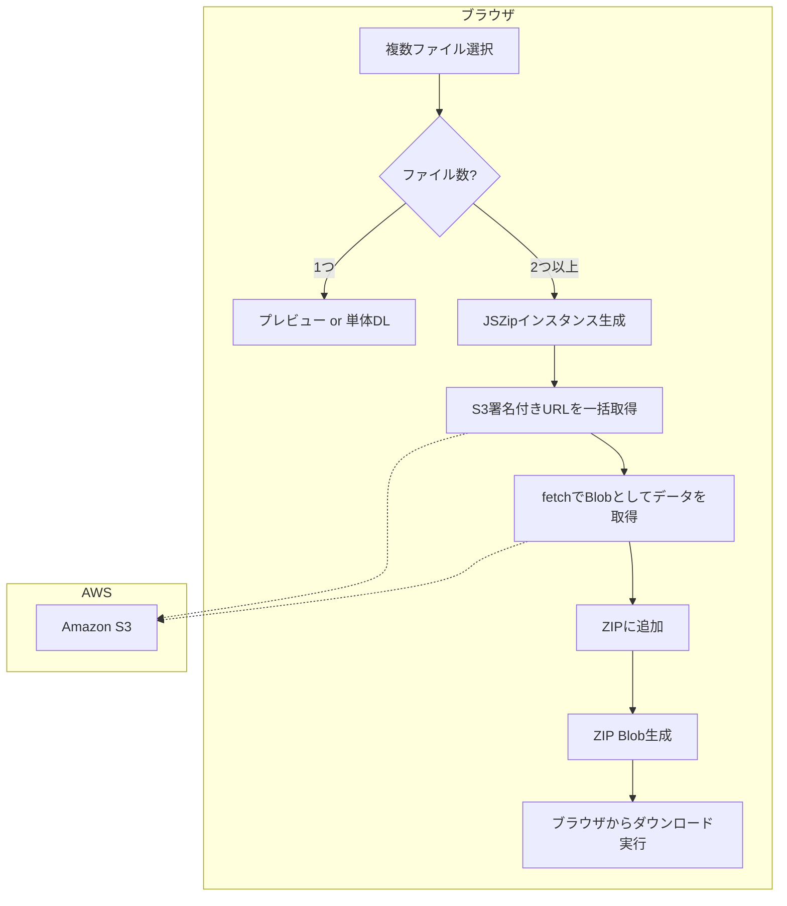

## 概要
第7話でバージョン管理の基盤が整い、ドキュメント管理システムとしての信頼性が向上しました。しかし、実際に業務で使い始めると、「10個のファイルを一つずつクリックしてダウンロードするのが面倒」「中身を確認したいだけなのに、いちいちダウンロードフォルダが汚れる」といった、UX面での課題が浮き彫りになりました。

今回は、`jszip` を使ったクライアントサイドでの一括ZIP生成や、MIMEタイプを判別して「表示」と「保存」を賢く使い分けるプレビュー機能の実装プロセスを紹介します。

## 実装内容

### 1. `jszip` による一括ダウンロードの自動ZIP化
複数のファイルが選択された際、ブラウザの連続ダウンロード制限（ポップアップブロック）を回避し、かつユーザーの手間を減らすため、クライアントサイドでZIPアーカイブを生成する機能を実装しました。

```tsx
// src/features/document-management/hooks/useDocumentOperations.tsx (抜粋)
import JSZip from 'jszip';

export const useDocumentOperations = (...) => {
  const handleZipDownload = async (files: FileItem[]) => {
    if (files.length === 0) return;
    setIsDownloading(true);

    try {
      const zip = new JSZip();
      
      // 各ファイルの署名付きURLを取得し、Blobとして取得してZIPに追加
      const downloadPromises = files.map(async (file) => {
        const result = await getUrl({ path: file.path });
        const response = await fetch(result.url.toString());
        const blob = await response.blob();
        zip.file(file.fileName, blob);
      });

      await Promise.all(downloadPromises);

      // ZIPファイルを生成してダウンロード実行
      const content = await zip.generateAsync({ type: 'blob' });
      const link = document.createElement('a');
      link.href = URL.createObjectURL(content);
      link.download = `archive_${Date.now()}.zip`;
      link.click();
      URL.revokeObjectURL(link.href);
    } catch (error) {
      console.error('ZIP生成エラー:', error);
    } finally {
      setIsDownloading(false);
    }
  };
  // ...
};
```

### 2. ファイルタイプに応じたプレビューと保存の切り分け
PDFや画像など、ブラウザで直接表示可能なファイルは新しいタブで「表示」し、それ以外のOfficeファイルなどは「保存（ダウンロード）」を強制するロジックを構築しました。

```tsx
// src/features/document-management/hooks/useDocumentOperations.tsx (抜粋)
const handleSingleFileDownload = async (filePath: string, forceDownload: boolean = false) => {
  const result = await getUrl({ path: filePath });
  const fileName = getFileNameFromPath(filePath);
  const extension = fileName.split('.').pop()?.toLowerCase();

  const viewableTypes = ['pdf', 'jpg', 'jpeg', 'png', 'gif'];
  const isViewable = extension && viewableTypes.includes(extension);

  if (isViewable && !forceDownload) {
    // ブラウザの別タブで開く（プレビュー）
    window.open(result.url.toString(), '_blank');
  } else {
    // aタグを作成してダウンロード実行
    const link = document.createElement('a');
    link.href = result.url.toString();
    link.download = fileName;
    link.click();
  }
};
```

## 遭遇した問題

### 1. ブラウザによる「連続ダウンロード」のブロック
最初はループを回して `window.open` や `a.click()` を連続実行していましたが、ブラウザのセキュリティ機能により、2つ目以降のダウンロードが「ポップアップのブロック」として無効化されてしまう問題に遭遇しました。

### 2. 大量ダウンロード時のメモリ消費と待機時間
数十個のファイルを一括ダウンロードしようとすると、`Promise.all` ですべての通信を同時に開始するため、ブラウザのメモリを大量に消費し、レスポンスが極端に低下するケースがありました。

### 3. S3署名付きURLの有効期限
ZIP生成に時間がかかると、最初に取得した署名付きURLの有効期限（デフォルトでは短い）が切れ、一部のファイルのダウンロードに失敗する現象が発生しました。

## 解決アプローチ

### 1. 「2ファイル以上はZIP」という仕様の策定
技術的に連続ダウンロードを許可するようユーザーに設定を求めるのはUXが悪いため、「複数が選ばれたらシステム側で1つのZIPにまとめる」という仕様に固定しました。これにより、ブラウザの制限を回避しつつ、ユーザーにとってもファイル管理が容易になります。

### 2. 通信の並列数制御と進捗表示
一括処理の際は `setIsDownloading(true)` でUIをロックし、スニッパーを表示することで「処理中であること」を明示しました。また、`jszip` はクライアントサイドで動作するため、サーバーの負荷を増やさずに処理を完結させることができました。

### 3. メモリ管理の徹底
`URL.createObjectURL` で生成したURLはメモリ上に残り続けるため、処理完了後に必ず `URL.revokeObjectURL` を呼び出し、メモリリークを防ぐようにしました。

## 最終的な解決策

### ZIP生成フローの図解



### 進捗フィードバックの実装
一括処理中は「ZIPファイルを生成しています...」という通知（Snackbar）を表示し、ユーザーが不安にならないような工夫を加えました。

```tsx
// 通知コンポーネントとの連携
setSnackbar({
  open: true,
  message: files.length > 1 ? 'ZIPファイルを生成中です...' : 'ダウンロードを開始します...',
  severity: 'info'
});
```

## 学んだこと

### 「ブラウザの壁」を考慮した設計
ウェブアプリケーションは常にブラウザのセキュリティ制限（クロスオリジン通信、ポップアップブロック、メモリ制限）の影響を受けます。これらを「回避する」のではなく、制限の中で「ユーザーにとって最も自然な挙動（ZIP化など）」を提案することの重要性を学びました。

### クライアントサイドでの重い処理の是非
`jszip` による処理はユーザーのPCリソースを使用します。数GB単位のファイルを扱う場合はLambda（バックエンド）でZIP化してS3に置く方が適切ですが、数MB〜数十MB程度のオフィス文書中心であれば、クライアントサイドで完結させる方が「サーバー代がかからない（月1万に収める）」という今回のプロジェクト目標に合致することを再認識しました。

### MIMEタイプの重要性
ファイルの拡張子だけで判断するのではなく、バックエンドから返ってくる `contentType` を適切に扱うことで、意図しないダウンロードや表示エラーを防ぎ、堅牢なUXを構築できることを学びました。

## 次回予告
機能が充実し、UXも向上してきました。いよいよ本番運用が近づいています。次回は、インターネット上に公開するアプリを悪意のある攻撃から守るための「WAF（Web Application Firewall）」の設定と、異常を早期に検知するための「CloudWatch」による監視基盤の構築について解説します。