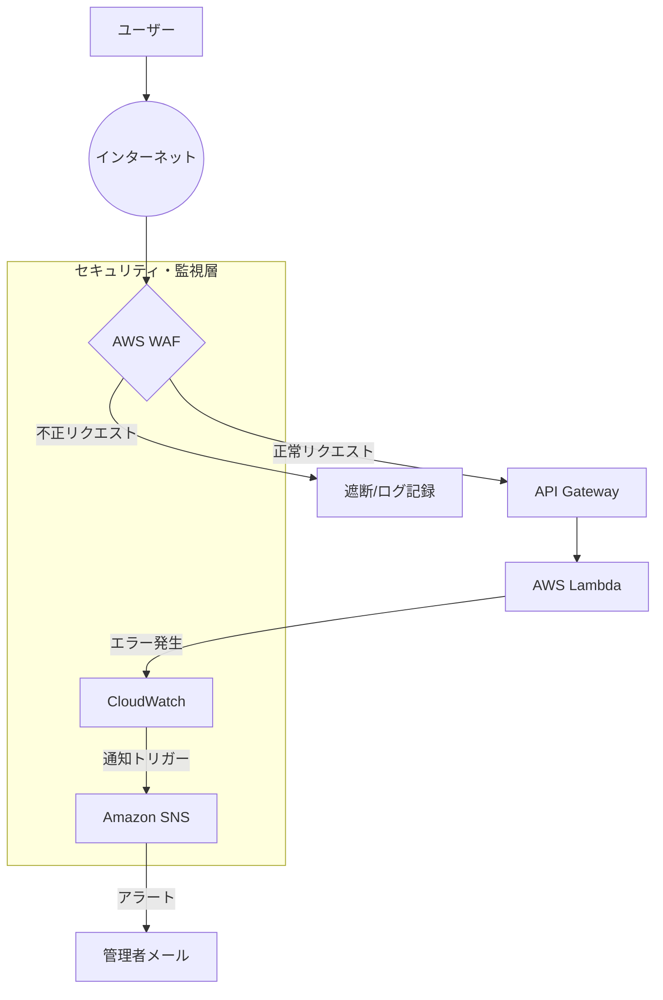

## 概要
第8話までで、ドキュメント管理アプリとしての機能とUXはほぼ完成しました。しかし、これを社外からもアクセス可能な「本番環境」として公開するためには、悪意のある攻撃や予期せぬシステムダウンからアプリを守る仕組みが不可欠です。

今回は、AWS WAF（Web Application Firewall）による不正アクセスの遮断と、Amazon CloudWatchによるシステムの異常検知を、Amplify Gen2の「Backendプロパティ」を活用して構築した記録を共有します。

## 実装内容

### 1. AWS WAFによる防御壁の構築
API Gatewayへの過剰なリクエスト（DDoS攻撃）や、特定のIPアドレス以外からのアクセスを制限するため、AWS WAFを導入しました。Amplify Gen2では `amplify/backend.ts` 内でCDKコンストラクトを直接記述できます。

```typescript
// amplify/security/waf-config.ts (抜粋)
import { CfnWebACL } from 'aws-cdk-lib/aws-wafv2';
import { Construct } from 'constructs';

export class GlobalAccessWAF extends Construct {
  public readonly webAcl: CfnWebACL;

  constructor(scope: Construct, id: string) {
    super(scope, id);

    this.webAcl = new CfnWebACL(this, 'AppWebACL', {
      defaultAction: { allow: {} },
      scope: 'REGIONAL',
      visibilityConfig: {
        cloudWatchMetricsEnabled: true,
        metricName: 'AppWebACL',
        sampledRequestsEnabled: true,
      },
      rules: [
        {
          name: 'LimitRequests',
          priority: 1,
          action: { block: {} },
          statement: {
            rateBasedStatement: {
              limit: 1000, // 5分間で1000リクエストを超えたら遮断
              aggregateKeyType: 'IP',
            },
          },
          visibilityConfig: {
            cloudWatchMetricsEnabled: true,
            metricName: 'LimitRequests',
            sampledRequestsEnabled: true,
          },
        },
      ],
    });
  }
}
```

### 2. CloudWatchによる監視アラームの設定
Lambda関数でエラーが発生した際や、APIのレスポンスが極端に遅くなった際に、即座にメール通知を受け取れるよう監視基盤を構築しました。

```typescript
// amplify/security/monitoring-config.ts (抜粋)
import { Alarm, ComparisonOperator } from 'aws-cdk-lib/aws-cloudwatch';
import { Construct } from 'constructs';

export class SecurityMonitoring extends Construct {
  constructor(scope: Construct, id: string) {
    super(scope, id);

    // Lambdaのエラー発生率を監視
    new Alarm(this, 'LambdaErrorAlarm', {
      metric: someLambdaFunction.metricErrors(),
      threshold: 1,
      evaluationPeriods: 1,
      comparisonOperator: ComparisonOperator.GREATER_THAN_OR_EQUAL_TO_THRESHOLD,
      alarmDescription: 'Lambda関数でエラーが発生しました。',
    });
  }
}
```

## 遭遇した問題

### 1. `visibilityConfig` 定義の漏れによるデプロイ失敗
WAFの `CfnWebACL` を定義する際、本体だけでなく「個別のルール」に対しても `visibilityConfig` の設定が必須であることを知らず、デプロイ時に以下のエラーが発生しました。

> `Property visibilityConfig is required for Rule 'LimitRequests'`

ドキュメント上の「Required」の文字を見落としていたため、すべてのルールに対して同じ設定を記述する必要があることに気づくのに時間がかかりました。

### 2. API Gatewayとの関連付けのタイミング
WAFを定義しただけではAPIは守られません。`CfnWebACLAssociation` を使ってAPI GatewayとWAFを紐付ける必要がありますが、API Gatewayのステージが作成される前に紐付け処理が走ってしまい、「リソースが見つからない」というエラーに遭遇しました。

### 3. CDKのプロパティ名のタイポ
AIから提案されたコードの中で、一部のプロパティ名（例：`cloudwatchMetricsEnabled`）の頭文字が大文字になっていたり、古いバージョンの名称が混ざっていたりすることで、TypeScriptのコンパイルエラーが発生しました。

## 解決アプローチ

### 1. AWS公式ドキュメント（L1コンストラクト）の精読
Amplify Gen2で `Cfn` から始まるリソース（L1コンストラクト）を扱う際は、ほぼ生のCloudFormationの設定値を記述することになります。AIの提案を鵜呑みにせず、AWS公式の CfnWebACL Resource Specification を照らし合わせて、必須項目と型を一つずつ確認しました。

### 2. 依存関係の明示的設定
関連付けのエラーを解決するため、CDKの `addDependency` メソッドを使用しました。これにより、「API Gatewayのデプロイが完了してからWAFを紐付ける」という実行順序を強制しました。

```typescript
// amplify/backend.ts (抜粋)
const wafAssociation = new CfnWebACLAssociation(backend.stack, 'WAFAssociation', {
  resourceArn: `arn:aws:apigateway:${stack.region}::/restapis/${api.restApiId}/stages/dev`,
  webAclArn: wafConfig.webAcl.attrArn
});

// 明示的に依存関係を追加
wafAssociation.node.addDependency(api.deploymentStage);
```

## 最終的な解決策

### セキュリティと監視の統合定義
`amplify/backend.ts` を「インフラの司令塔」として、WAFの適用から監視設定までを体系的にまとめました。

```typescript
// amplify/backend.ts (最終形に近い構成)
export const backend = defineBackend({
  auth,
  data,
  // ... 既存のリソース
});

const wafConfig = new GlobalAccessWAF(backend.stack, 'AppWAF');
const monitoring = new SecurityMonitoring(backend.stack, 'AppMonitoring');

// API GatewayへのWAF適用
new CfnWebACLAssociation(backend.stack, 'ApiWafAssoc', {
  resourceArn: apiArn, // API GatewayのARN
  webAclArn: wafConfig.webAcl.attrArn
});
```

### CloudWatchによる可視化
重要なメトリクスをCloudWatchダッシュボードに集約し、ブラウザから一目でアプリの状態（リクエスト数、エラー率、WAFでの遮断数）を確認できる環境を整えました。

## Mermaidによる防御アーキテクチャ図



## 学んだこと

### 「Security as Code」の威力
非エンジニアにとって、AWSコンソールをポチポチ操作して設定するのは一見楽ですが、設定漏れや「以前どう設定したか」を忘れるリスクがあります。Amplify Gen2を通じてコードでセキュリティを定義することで、環境を壊しても（`sandbox delete`しても）即座に同じ強固な壁を再構築できる再現性に感動しました。

### 生成AIと公式ドキュメントの「使い分け」
AIは複雑なCDKの構造をサクッと提案してくれる非常に強力なツールですが、最新のプロパティ名や必須項目については、やはり公式ドキュメントが「正」です。AIに大枠を書いてもらい、公式ドキュメントで細部を詰めるというワークフローが、インフラ構築において最も効率的であることを学びました。

### 運用のための「可観測性」
「作って終わり」ではなく、動いているものを「見える化」することが、ビジネスアプリ運用における安心感に繋がります。アラーム設定を通じて、システムの健康状態を常に把握する習慣が身につきました。

## 次回予告
いよいよ本シリーズも最終回です。開発から運用までを完全に自動化するための「CI/CDパイプライン」の構築と、Node.js 22への最新環境アップデートの様子をレポートします。