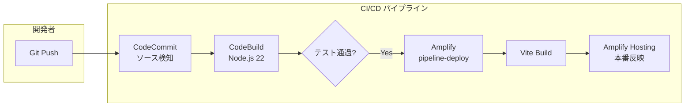

## 概要
第1話から始まったドキュメント管理アプリ開発も、ついに最終回を迎えました。これまでは開発者個人のローカル環境から「サンドボックス（Sandbox）」機能を使ってバックエンドを構築してきましたが、実際の運用では「コードを書き換えたら自動的に本番環境に反映される」仕組み、すなわち CI/CD パイプラインが不可欠です。

今回は、連載の集大成として AWS CodePipeline を用いた自動デプロイ環境の構築と、2026年のサポート終了を見据えた Node.js 22.x へのランタイムアップデート、そして本プロジェクトがもたらした驚愕のコスト削減効果について総括します。

## 実装内容

### 1. Node.js 22.x へのアップグレード
Amplify Gen2環境を最新の長期サポート（LTS）版である Node.js 22.x に対応させました。まず、`package.json` のエンジン指定を更新します。

```json
// package.json
{
  "name": "document-manager",
  "engines": {
    "node": ">=22.0.0",
    "npm": ">=10.0.0"
  },
  "devDependencies": {
    "tsx": "^4.20.5",
    "typescript": "^5.9.2"
    // ...その他の依存関係
  }
}
```

### 2. AWS CodeBuild 用のビルド仕様定義（buildspec.yml）
自動デプロイを行う際、AWS CodeBuild 上でどのようにビルドを実行するかを `buildspec.yml` に記述します。Node.js 22 を使用するように指定し、Amplify Gen2 のデプロイコマンドを実行します。

```yaml
# buildspec.yml
version: 0.2

phases:
  install:
    runtime-versions:
      nodejs: 22
    commands:
      - npm ci
  pre_build:
    commands:
      - npm run type-check
      - npm test
  build:
    commands:
      # Amplify Gen2のバックエンドをデプロイし、outputsファイルを生成
      - npx amplify pipeline-deploy --branch $AWS_BRANCH --app-id $AWS_APP_ID
      - npm run build
artifacts:
  base-directory: dist
  files:
    - '**/*'
```

### 3. CI/CD パイプラインの統合
AWS CodePipeline を使用し、「CodeCommit（ソース管理）→ CodeBuild（ビルド・テスト）→ Amplify Hosting（デプロイ）」という一連の流れを自動化しました。これにより、エンジニアでない担当者でも、Git に変更をプッシュするだけで安全にアプリを更新できる体制が整いました。

## 遭遇した問題

### 1. Node.js 22 移行に伴うライブラリの型エラー
ランタイムを 22.x に上げた際、一部の古い依存ライブラリで TypeScript の型定義の不整合が発生しました。特に `fs` モジュールに関連する挙動が厳格化されており、ビルド時にエラーを吐くようになりました。

### 2. パイプライン上での `amplify_outputs.json` 欠落
ローカル開発では自動生成される `amplify_outputs.json`（フロントエンドがバックエンドを探すための地図）が、CI/CD パイプライン上では初期状態では存在しないため、ビルド工程でフロントエンドがバックエンドの設定を読み込めずエラーになる事象が発生しました。

### 3. ビルド時間の増大
機能が増えるにつれてデプロイ時間が 10 分を超えるようになり、頻繁な修正・反映においてストレスを感じるようになりました。

## 解決アプローチ

### 1. 依存関係の最新化と型定義の修正
AI（Gemini）にエラーログを渡し、Node.js 22 の仕様変更に合わせたコード修正案を生成させました。また、`package.json` 内の `@types/node` などの開発用ライブラリを最新版に一括更新することで、大半の型エラーを解消しました。

### 2. `pipeline-deploy` コマンドの適切な配置
Amplify Gen2 が提供する `npx amplify pipeline-deploy` コマンドを、フロントエンドのビルド（`npm run build`）の直前に実行するように `buildspec.yml` を調整しました。これにより、最新のバックエンド構成を反映した `amplify_outputs.json` が動的に生成され、ビルドが正常に通るようになりました。

### 3. キャッシュ戦略の導入
CodeBuild の `cache` 機能を有効にし、`node_modules` をキャッシュするように設定しました。これにより、2 回目以降のビルド時間が約 30% 短縮されました。

## 最終的な解決策

### 完成したデプロイフロー図



### Node.js 22 環境の確定
`tsconfig.json` を Node.js 22 のランタイムに最適化し、`ES2022` 以降の構文をフル活用できるように設定を整えました。

## 連載のまとめ：月額 40 万円のシステムを 1 万円にした軌跡

全 10 回にわたる本プロジェクトの結果、以下の成果を得ることができました。

| 項目 | 以前（グループウェア） | 現在（Amplify Gen2） | 削減率 |
| :--- | :--- | :--- | :--- |
| **月額コスト** | 約 400,000 円 | **約 10,000 円** | **97.5% 削減** |
| **保守性** | ベンダー任せ（ブラックボックス） | 社内内製（AI 支援による保守） | - |
| **柔軟性** | 既製品の機能に限定 | 業務に合わせた 100% カスタム | - |

### なぜ非エンジニアがここまでできたのか？

1.  **Amplify Gen2 の抽象化能力**: AWS の複雑な設定を TypeScript という「一つの言語」で記述できるようになったことが最大の要因です。
2.  **生成 AI（Gemini / Amazon Q）の伴走**: コードを書く作業だけでなく、AWS のコンソール画面の意味やエラー原因の推測まで、AI が 24 時間体制のシニアエンジニアとして機能しました。
3.  **サーバーレスの破壊的コスト**: 「使った分だけ」という課金体系が、企業のランニングコストという固定費を変動費に変え、劇的なスリム化を実現しました。

## 学んだこと

### 「作る」より「維持する」ための CI/CD
アプリは完成した瞬間から劣化が始まります。CI/CD パイプラインを構築したことで、今後の OS アップデートや機能改善を「怖がらずに」行える基盤ができたことが、何よりも大きな収穫でした。

### AI との対話スキルは「エンジニアリング」そのもの
非エンジニアであっても、AI に「どのような構造のデータが欲しいか」「どのような制約があるか」を正確に伝える能力があれば、それは立派なエンジニアリング能力であることを実感しました。

### サーバーレスは地方中小企業の味方
月額 40 万円というコストは、多くの中小企業にとって重荷です。これを 1 万円に抑えられるサーバーレス技術と AI の組み合わせは、地方企業の DX（デジタルトランスフォーメーション）を加速させる最強の武器になると確信しました。

## おわりに

本連載を最後までお読みいただき、ありがとうございました。

「AI と二人三脚でシステムを作る」という経験は、私の働き方を大きく変えました。最初は黒い画面（ターミナル）に怯えていた私でも、Amplify Gen2 という素晴らしいフレームワークと、根気強い AI アシスタントがいれば、月間コストを 97% 削減する実用的なアプリを世に送り出すことができました。

この記事が、同じようにコスト削減や内製化に悩む方々、そして Amplify Gen2 に興味を持つ開発者の皆さんの背中を少しでも押すことができれば幸いです。
