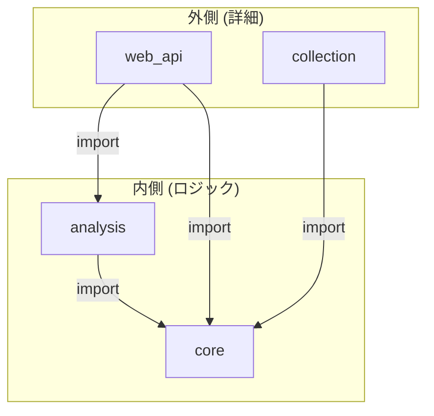

# 【設計編】AIが提案した「クリーンアーキテクチャ」

## はじめに：

前回の「環境編」で「アプリを作る環境」と「アプリが動く環境」が出来ました。
次はAIに「競馬予想アプリを作りたいんだけど、どんなディレクトリ構造がいい？」と聞いてみました。
すると、返ってきたのは次のようなディレクトリ構造です。

```
keiba_app/
├── src/
│   └── keiba/
│       ├── core/         
│       ├── pipelines/    
│       └── services/     
... (その他)
```

今回は、AIが示してくれた**「クリーンアーキテクチャ」**という設計思想について解説します。

## クリーンアーキテクチャという考え方

難しそうに聞こえますが、要点は非常にシンプルです。

> **関心事の分離 (Separation of Concerns)**

つまり、「データ収集」「分析」「Web表示」など、役割の違うコードは混ぜずに、きれいに分けましょう、という考え方です。

さらに重要なルールが**「依存性のルール」**です。

> **内側（ビジネスロジック）は、外側（DBやUIなどの詳細）を知らない**

これは、**「import文は、外側から内側に向かってしか書いてはいけない」** というルールです。



例えば、`analysis`（分析）の中で `web_api`（Web表示）のコードを `import` してはいけません。
逆に、`web_api` が `analysis` を `import` して使うのはOKです。

これを守ることで、例えば「Web画面のデザインをガラッと変えたい」とか「データベースをPostgreSQLから別のものに変えたい」と思っても、アプリケーションの核となるロジック（内側）を一切変更せずに済むようになります。
外側の変更が内側に波及しない、これが最大のメリットです。


### `services`: 機能ごとのサービス群

まず`services`というディレクトリ内に、アプリケーションの大きな機能を分けました。

- **`collection` (データ収集):** ネットからレース情報やオッズを取ってくる機能。
- **`analysis` (分析):** 集めたデータを分析し、予測モデルを作る機能。
- **`web_api` (Web表示):** 予測結果を人間が見やすいように表示する機能。

このように分けることで、「データ収集のロジックは`collection`を見ればいい」と、目的のコードがすぐに見つけられるようになります。

### `core`: 共通基盤

`core`は、どのサービスでも共通で使う「ルールブック」のようなものです。

- データベースへの接続方法
- アプリケーション全体の設定
- 共通で使うデータ形式（Pydanticモデル）

例えば、`analysis`サービスが「DBに接続したい」と思ったら、`core`で決められたルールに従って接続します。`core`は、どのサービスが自分を呼び出しているかを知りません。これが「依存性のルール」です。

### `pipelines`: 処理フロー定義

`pipelines`は少し特殊な役割です。「モデル学習」や「レース予測」といった一連の作業は、`analysis`サービスの様々な機能を特定の順番で呼び出す必要があります。

1.  `data_loader`でデータを読み込み
2.  `feature_generator`で特徴量を作り
3.  モデルで学習（`train`）・予測（`prediction`）を行う

この一連の流れ（パイプライン）を定義するのが`pipelines`の役割です。これは、工場で製品を組み立てる際の「組立指示書」に似ています。指示書自体は部品を作りませんが、どの部品（機能）をどの順番で使うかを定義します。

## まとめ：なぜこの構造なのか

- **保守性の向上:** 機能が独立しているので、修正が他に与える影響を心配しなくて済む。
- **再利用性の向上:** `core`に定義した機能は、新しいサービスでも再利用できる。
- **テストの容易さ:** 機能ごとにテストが書けるので、品質を担保しやすい。

次の記事は、データ収集についてです。