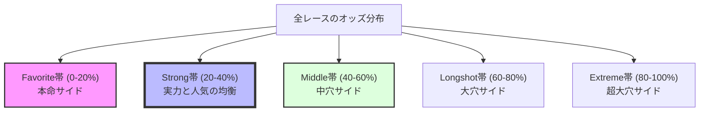
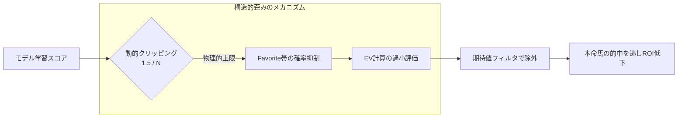
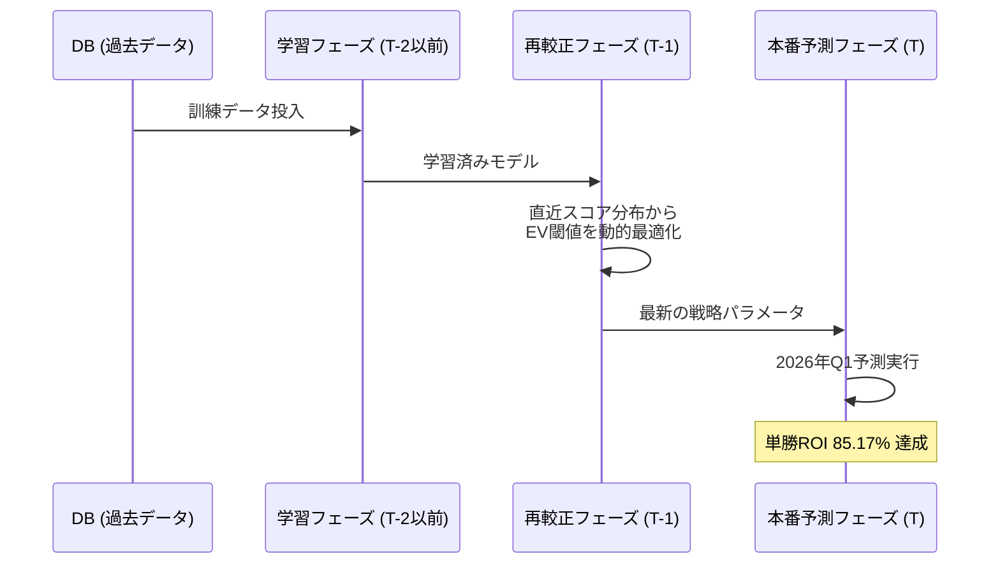

# 1. 概要
前回（第22話）では、**動的クリッピング**と**重み付き保序回帰（Isotonic Regression）**を導入し、確率校正（Calibration）の精密化に成功しました。期待値（EV）運用のための「正確な物差し」を手に入れたはずの私たちは、今回、満を持して「買い目の絞り込みによるROI 100%超え」という最終関門に挑みました。

しかし、そこで待ち受けていたのは、統計学の教科書通りにはいかない"**「市場の構造的歪み」**という巨大な壁でした。期待値が高い馬を狙えば狙うほどROIが下がるという逆転現象。その正体を突き止めるべく、私たちは第18話で構築した運用基盤をフル活用し、モデルの「物理的限界」と向き合うことになります。

# 2. 実装内容 (Plan、Do)
期待値運用（数学的投資）を成立させるため、以下の戦略的アプローチを実装・検証しました。

### 2-1. 市場オッズ帯（Odds Zone）の定義

全レースのオッズを昇順に並べ、20%ずつに等分割した五分位客観評価を導入しました。

### 2-2. logit変換による解像度の向上
校正器（Isotonic Regression）への入力をスコアの絶対値から、レース内での**パーセンタイルランク**、あるいは**logitスケール**に変換して入力する手法を採用しました。これにより、密集していた上位帯の分散を拡大し、本命馬同士の微細な実力差を校正器が捉えやすくすることを目指しました。

### 2-3. 第18話「3フェーズ基盤」の高度な活用（再較正の深化）
第18話で導入した **[学習] → [戦略再較正(T-1)] → [本番予測(T)]** の3フェーズ・ウォークフォワード基盤を、今回は「市場の歪み」を動的に補正するための標準インフラとして活用しました。

単なるスコアデフレ対策ではなく、再較正フェーズ（T-1）において、**オッズ帯ごとに異なる期待値閾値を設定する「戦略的オフセット」**を動的に決定する仕組みへと高度化させています。

$$
\text{Selection} = 
\begin{cases} 
EV \ge 1.2 & (\text{if } \text{Favorite帯}) \\
EV \ge 2.0 & (\text{otherwise})
\end{cases}
$$

# 3. 遭遇した問題 (Check)
意気揚々と実行したシミュレーションでしたが、結果は惨敗でした。

### 3-1. 期待値運用の「逆転現象」
理論上、期待値（EV）閾値を引き上げるほどROIは向上するはずです。しかし、実験では"**「EV閾値を上げるとROIが下がる」**という統計的矛盾が発生しました。

### 3-2. Favorite帯における「3倍乖離」
原因を突き止めるため、層別分析を行ったところ、深刻な校正歪みが判明しました。
*   **モデル予測**：この本命馬の勝率は **7.2%** です。
*   **実際の結果**：この帯域の馬は **23.0%** の確率で勝っています。
モデルが**Favorite帯**を **3倍も過小評価** しており、これがEV計算を通じて「お宝馬」を真っ先に除外するフィルターとして機能してしまっていたのです。

### 3-3. 物理上限「1.5/N」の罠
この乖離の正体は、過信を抑制するために導入した**動的クリッピング**でした。
$$ \text{Prob}_{max} = \frac{1.5}{N} $$
18頭立てレースの場合、一頭の最大確率は物理的に **0.083** に制限されます。どれほど実力が突出していてもこの「見えない天井」を突破できないため、実勝率 20%超の馬を正しく評価できなくなっていたのです。

# 4. 解決アプローチ (Action)
物理的な制約が判明した今、モデルを無理に矯正する（ECEペナルティを強めるなど）ことは、むしろ全体のバランスを壊すノイズとなることが判明しました。

### 4-1. 「Strong帯」への特化
全方位の改善を諦め、**「モデルが真実を語っている帯域」**を特定することに舵を切りました。
分析の結果、オッズ 5.0〜15.0倍の **Strong帯** において、モデル確率と実勝率の乖離が最小（EV計算が最も正確）であることを発見しました。この帯域に特化する `odds_zone_filter` を実装し、エッジが純粋に機能する領域へ集中投資する戦略を試行しました。

### 4-2. 統合スコアの純化（anauma_weight=0）
確率はランキングモデル単体で校正されているため、購入馬を抽出する順位スコアに穴馬モデルを混入させると、確率と順位のミスマッチが発生します。これを防ぐため、`anauma_weight = 0.0` とし、穴馬モデルは加算用ではなく「足切り（フィルタ）」としてのみ活用する設計に回帰しました。

# 5. 最終的な解決策
今回は、以下の安定したベースラインを確立しました。

- **モデル構成**：`num_leaves=127`, `feature_fraction=0.7`, `num_boost_round=500` 
- **戦略構成**：
    - `anauma_weight = 0.0`（実力順位の死守）
    - `top_n = 3`, `ev_threshold = 2.0` の手動固定
    - `Optuna seed = 42` による完全再現性の確保
- **主要メトリクス**：
    - **単勝ROI**：**85.17%** 
    - **In-Race Spearman相関**：**0.2355** 
    - **ECE (All Zones)**：**0.0247** 
    - **Favorite帯乖離倍率**：約3.5倍（構造的限界として容認）

*図：第18話から続く3フェーズ運用フロー。今回は「市場の歪み」を検知し回避するための標準インフラとして機能。*

# 6. 学んだこと
### 「物差し」が狂った投資の危うさ
期待値運用を行うには、ベースとなる確率の「目盛り」が正しいことが絶対条件です。校正が歪んでいる（Favorite帯の過小評価）状態での閾値操作は、むしろ投資効率を悪化させる毒薬に変わることを痛感しました。

### 数学的限界の特定という成果
ROIが90%に届かなかったことは一見「失敗」に見えますが、その原因がロジックのバグではなく **「動的クリッピングによる物理上限」**にあると数学的に突き止めたことは大きな前進です。システムの構造的限界を知ることこそが、次なるアーキテクチャ設計には不可欠な知見でした。

# 7. 次回予告
現在の「1着特化型ランキングモデル」には、複勝圏内（3着以内）の識別能において市場に劣るという限界も見えてきました。
次回、この物理上限を突破するため、私たちはアーキテクチャを抜本的に刷新します。
**複勝専用バイナリ分類モデル「Top3モデル」**の導入。単一モデルの限界を超え、マルチモデル・マルチ券種ポートフォリオへの挑戦が始まります。
