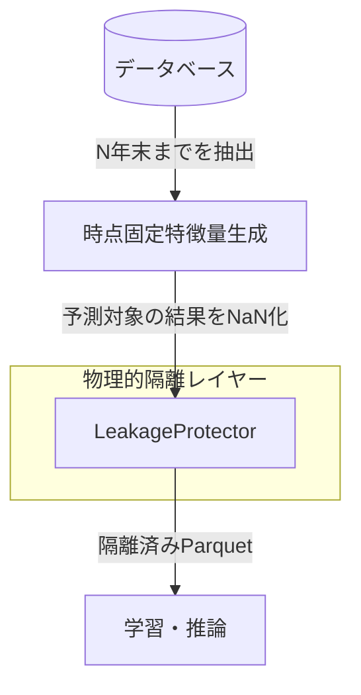

## 1. 概要

前回の連載（第14話）までで、実運用を想定したデータ基盤と管理画面を構築しました。これを受けて行ったシミュレーションでは、2021年から2025年までのバックテスト結果において ROI 200% を超えるという、極めて高い数値が記録されました。

しかし、この数値を精査した結果、機械学習において最も警戒すべき課題である「データリーク（学習時における未来情報の参照）」が構造的に発生していることが判明しました。

今回は、バックテストにおける高精度の正体を技術的に分析し、それを解決するために導入した「時点固定（Point-in-Time: PiT）特徴量生成」と、シミュレーションパイプラインの刷新について解説します。

## 2. 実装内容

実戦に近い評価を行うため、まずは「ウォークフォワード・シミュレーション」の仕組みを `SimulationEngine` として標準化しました。これは、過去のデータを単に分割するのではなく、以下のプロセスを年度単位で繰り返すものです。

1. **学習**: 予測対象年の前年末までのデータを抽出してモデルを学習
2. **予測**: 予測対象年（1年分）のレースに対して推論を実行
3. **更新**: 予測が終わった年のデータを学習セットに加え、再学習して翌年を予測

このループを制御するため、`simulation_engine.py` を中心としたパイプラインを構築しました。

```python
# simulation_engine.py の一部（ロジック抽出）

class SimulationEngine:
    def run_walk_forward(self, start_year: int, end_year: int):
        for target_year in range(start_year, end_year + 1):
            logger.info(f"Target Year: {target_year} simulation starting...")
            
            # 学習データの準備（ターゲット前年まで）
            train_df = self.data_loader.load_until(target_year - 1)
            
            # モデル学習
            model = self.trainer.train(train_df)
            
            # 予測（ターゲット年のみ）
            # ここで予測対象年のデータに未来情報が含まれていないかが重要になる
            test_df = self.data_loader.load_year(target_year)
            predictions = self.predictor.predict(model, test_df)
            
            self.storage.save_results(target_year, predictions)
```

## 3. 遭遇した問題

シミュレーションを実行した結果、2021年から2025年の期間において、穴馬検知モデル（Alpha-balanced Focal Loss）が ROI 200% 超という、競馬予測としては非現実的な収益性を記録しました。

この異常な高精度を検証するため、未知の未来データである2026年Q1（第1四半期）に対してフォワードテストを実施したところ、精度が急落しました。

なお、2026年Q1のデータは、意図的にレース結果の情報を除いた状態でシミュレーションに投入しています。2025年までのデータセットにはレース結果を含んでおり、シミュレーションの中で未来情報をマスキングしながら予測しているため、もしデータリークが存在すれば、物理的に結果データを持たない2026年Q1の結果だけが悪化するという形で顕在化します。
- **2021-2025年（バックテスト）**: 的中率が非常に高く、ROI 200%超
- **2026年Q1（フォワードテスト）**: ROI 85%未満。的中率がランダムベースラインと同等まで低下

この乖離の根本原因は、**「構造的リーク」**にありました。具体的には、特徴量として使用していた「騎手や調教師の過去勝率」などの集計値に問題がありました。

特徴量生成時に、全期間が含まれる `features_latest.parquet` を一括で集計していたため、2021年のレースを予測する際に、2025年までの実績を含んだ統計値がモデルに渡されていたのです。行単位で `shift(1)` を適用していても、ファイル全体での集計（GroupBy等）を行っている場合、時間軸を跨いだ情報の混入を防ぐことはできません。

## 4. 解決アプローチ

この構造的リークを根絶するためには、特徴量生成プロセスそのものを、予測時点の状態（Point-in-Time）で隔離する必要があります。

「2021年の予測を行う際は、2021年1月1日時点のデータベースの中身だけが見えている状態」を物理的に再現しなければなりません。そこで、以下の2つのアプローチを採用しました。

### 4-1. 時点固定（Point-in-Time）特徴量生成
シミュレーションのループ内で、各年ごとに特徴量を再計算する仕組みを導入しました。

### 4-2. 物理的遮断（LeakageProtector）
予測対象年以降の情報が、特徴量生成ロジックのミスによって紛れ込まないよう、物理的にデータを消去（NaN化）するガードレールを設置しました。



## 5. 最終的な解決策

私たちは `leakage_protector.py` を作成し、シミュレーションの各ステップで強制的なマスク処理を実行するように変更しました。

### 時点固定パイプラインの実装

各年（N年）のシミュレーションにおいて、以下の処理を自動化しました。

1. **スナップショットの動的生成**: データベースから「N年末までのレコード」のみをロードして特徴量を計算。
2. **結果カラムの動的マスク**: 予測対象となる年について、レース後にしか確定しないカラム（着順、タイム、確定オッズ、馬場状態、上がり3Fなど）を強制的に `NaN` 化。
3. **隔離ファイルの保存**: `features_2021.parquet` のように、年ごとの隔離された特徴量ファイルを一時的に生成し、それを推論に用いる。

```python
# leakage_protector.py の実装例

import numpy as np

class LeakageProtector:
    @staticmethod
    def mask_future_data(df, target_year):
        """
        ターゲット年以降の結果系情報を物理的に消去し、リークを遮断する
        """
        # レース後にしか判明しない情報のリスト
        post_race_cols = [
            'rank', 'finish_time', 'odds_win', 'popularity', 
            'margin', 'track_condition', 'last_3f_time', 'strategy'
        ]
        
        # ターゲット年以降（予測対象期間）のデータを特定
        mask = df['start_datetime'].dt.year >= target_year
        
        # 該当カラムを物理的にNaNで上書き
        # これにより、集計ロジックが誤って未来を参照してもデータが存在しない状態になる
        df.loc[mask, post_race_cols] = np.nan
        return df
```

この「時点固定生成」への移行により、シミュレーションの計算コストは大幅に増加しましたが、得られる結果の信頼性は担保されました。

## 6. 学んだこと

### 行単位の `shift(1)` はリーク対策の第一歩に過ぎない
時系列データの分析において、自分自身の結果を参照しないための `shift(1)` は重要ですが、不十分です。集計特徴量（平均値、移動平均、ランキング等）を扱う場合、その集計対象範囲（ウィンドウ）そのものが時間軸で制限されているかを常に確認する必要があります。

### 物理的遮断による安全性の確保
「注意して実装する」という人的努力には限界があります。システム側でターゲット年以降のデータを物理的に消去する `LeakageProtector` のような仕組みを介在させることで、ロジックのミスに起因するリークを構造的に防ぐことができます。

### クリーンな環境での現実
リークを完全に排除した環境で再評価を行ったところ、穴馬検知モデルの Top 1% 的中率は **2.31%** となりました。これはランダムベースライン（2.28%）とほぼ同等です。つまり、これまでの高ROIは特徴量に含まれる未来情報に依存していたことが明らかになりました。ここから、真に予測能力を持つ特徴量を探す「再スタート」を切ることになりました。

## 7. 次回予告

リークを排除したクリーンな環境では、単純な過去集計だけでは穴馬（人気薄の激走）を捉えられないことが判明しました。

次回、「馬の潜在能力」という静的な指標から脱却し、前走からの変化や今回の条件好転を捉える「動的特徴量」を導入します。激走の予兆を捉えるための、エンジニアリングの試行錯誤を共有します。
