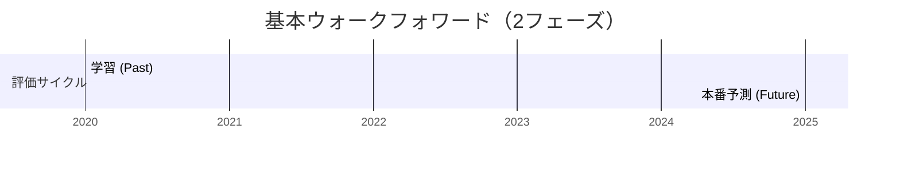
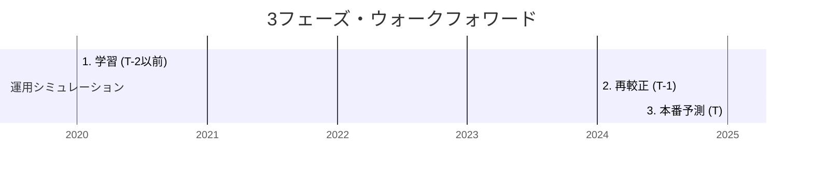

## 1. 概要

前回の記事では、ランキング学習（LTR）の導入と、LightGBMの `rank_xendcg` で発生した勾配爆発の克服について触れました。今回は、この基盤をさらに実戦的なものへと昇華させるため、モデルの更新に伴う「スコアデフレ」や分布変化を吸収するための「3フェーズ・ウォークフォワードエンジン」の構築に挑みました。

しかし、開発の過程で「的中率100%（NDCG=1.0）」という、一見完璧ながら中身が空っぽな「学習崩壊」という最大の罠に遭遇します。本記事では、この深刻なバグの原因特定と、AIを活用した開発統治（AI Rules）の策定、そして最終的な精度の劇的な回復（Spearman相関 0.40達成）までの道のりを記録します。

## 2. 実装内容

### 2-1. 課題の核心：『スコアデフレ』現象

本エンジンを開発する最大のきっかけは、**「スコアデフレ」**という現象でした。

競馬AIでは、最新の傾向を反映するために毎年モデルを再学習（ウォークフォワード学習）させますが、学習が進むにつれてモデルが生成する予測スコア（確率やランキングスコア）の絶対値が、過去のモデルに比べて全体的に低下していく傾向が見られました。

*   **発生する問題**: 例えば「スコア0.7以上の馬を買う」という**固定の絶対閾値**で運用している場合、モデルが更新されるたびにスコアの全体水準が下がるため、以前の基準では「買い」と判定される馬がいなくなり、最終的に購入件数が0件になる（機会損失）という事態に陥ります。
*   **原因**: 学習データの蓄積に伴いモデルがより慎重な予測を行うようになることや、特徴量の分布変化により出力のスケールが収縮することなどが挙げられます。

この「モデルごとに物差し（スコアの尺度）が狂う」問題に対応するため、固定の閾値ではなく、その時点のモデルに最適な閾値を動的に見つけ出す仕組みが必要となりました。

### 2-2. 3フェーズ・ウォークフォワードエンジンによる解決

モデルの更新に伴う「物差しのズレ」を修正するため、`SimulationEngine` を以下の3段階フローへ刷新しました。これにより、スコアデフレの影響を完全に吸収することができます。

1. **学習フェーズ (T-2以前)**: 過去データを用いてランキングモデルを学習します。
2. **再較正フェーズ (Recalibration / T-1)**: 
    本番予測の前年（T-1）を「リハーサル期間」として使用します。学習済みモデルで T-1 期間をスコアリングし、そのスコア分布に対して ROI が最大化される「そのモデル専用の閾値」や「戦略パラメータ」を Optuna で再探索します。
3. **本番予測フェーズ (T)**: 最適化された「最新の戦略」を用いて、本番（T）の予測に臨みます。

この方式の肝は、**「モデルが変われば戦略も変える」**という点にあります。デフレによってスコアが 0.7 から 0.5 に下がったとしても、再較正フェーズで「新しいモデルなら 0.5 以上が買い」と自動的に再定義されるため、運用が止まることなく、常にモデルのポテンシャルを最大限に引き出せるようになりました。

### 2-3. 13話の方式との決定的な違い

第13話で紹介したウォークフォワード法は、主に「時系列リークを防ぎながらモデルの予測精度を測る」ための**評価手法**でした。それに対し、今回の3フェーズ方式は、**「実運用における戦略決定プロセス」**までをシミュレーションに組み込んでいます。

#### 【Before】13話：基本ウォークフォワードの構造


#### 【After】18話：3フェーズ・ウォークフォワードの構造


| 項目 | 13話：基本方式 | 18話：3フェーズ方式 |
| :--- | :--- | :--- |
| **フロー** | 学習 (Past) → 予測 (Future) | 学習 (T-2) → **再較正 (T-1)** → 予測 (T) |
| **目的** | リークのない精度検証 | スコア変化への追従とROIの安定化 |
| **閾値の扱い** | 固定値（または勘） | **Optunaによる動的最適化** |
| **解決する課題** | 時系列的なカンニング | **スコアデフレ（モデル更新による分布変化）** |

第13話の方式では、モデルを更新しても「どの程度のスコアなら買うべきか」という戦略（閾値）が古いままになり、精度（Spearman相関）が高くてもROIが低下するリスクがありました。3フェーズ方式では、予測の直前に「今のモデルならこの閾値が最適」というリハーサルを行うため、より実戦的なシミュレーションが可能になります。

### 2-3. ハイブリッド統合スコアの設計

実力スコア（Ranking）と激走サイン（Anauma）を統合する際、単純な加算ではなく、Z-Score正規化を施した上での動的な重み付けを採用しました。

```python
# score_integrator.py 内のイメージ
def integrate_scores(rank_score, anauma_score, anauma_weight):
    # レース内でZ-Score化してスケールを合わせる
    z_rank = (rank_score - rank_score.mean()) / rank_score.std()
    z_anauma = (anauma_score - anauma_score.mean()) / anauma_score.std()
    
    # 最適化された重みで統合
    return z_rank + (z_anauma * anauma_weight)
```

## 3. 遭遇した問題

### 3-1. 偽りの的中率100%（学習崩壊）

シミュレーションを実行した際、ログに `valid's ndcg@1: 1.0` という異常な数値が表示されました。一見すると完璧な予測に見えますが、実態は以下の通りでした。

*   **ROI**: 0.6x（大幅なマイナス）
*   **Importance Sum**: 0.0（モデルが特徴量を一つも使っていない）
*   **RMSE**: 異常な低値（または計算不能）

### 3-2. 型不整合によるサイレントな失敗

`pd.merge` 後のインデックスリセットにより、馬の名前と予測スコアが別の馬に紐付く「データのズレ」が発生しました。また、`Categorical` 型の列に対して `fillna(0)` を適用しようとして `TypeError` でパイプラインが停止する事態も頻発しました。

## 4. 解決アプローチ

### 4-1. ラベル復元ロジックの修正

調査の結果、`NDCG=1.0` の原因は「リーク防止用のマスク処理」にありました。`LeakageProtector` が予測対象期間の結果を `NaN` 化する際、バリデーション用の正解ラベル（`y_val`）まで消し去っていたのです。

正解がすべて空のデータを渡されたLightGBMは、1イテレーション目で学習を放棄し、評価関数は分母がゼロになる等の理由で「1.0」という偽の数値を返していました。

```python
# SimulationEngine.py での修正
# マスキング済みのdfからではなく、元のdf_allからラベルを引き直す
y_val = df_all.loc[valid_idx, ['race_id', 'horse_number', 'target_rank']]
val_df = pd.merge(val_df_masked, y_val, on=['race_id', 'horse_number'])
```

### 4-2. フィンガープリントによる特徴量整合性の担保

学習時と推論時で特徴量の順序や種類がズレる「次元不一致」を防ぐため、学習完了時に使用したカラムの「指紋（Fingerprint）」を保存し、推論時に強制適用する仕組みを導入しました。

```python
# 学習時に保存
self.feature_fingerprint = X_train.columns.tolist()

# 推論時に適用
X_test = X_test.reindex(columns=self.feature_fingerprint)
```

## 5. 最終的な解決策

これらのデバッグと、`target_alpha` の探索範囲を 1.1〜1.9 に制限する数値安定化策により、以下の成果を達成しました。

1.  **精度の劇的な回復**: スピアマン相関係数は **0.4021** まで向上し、レース内の序列を高い解像度で捉えられるようになりました。
2.  **3フェーズ・パイプラインの完走**: 学習、再較正、予測の一気通貫フローが安定稼働し、年度ごとの「スコアデフレ」を動的閾値で克服できることを証明しました。
3.  **ハイブリッド予測のエッジ**: `anauma_weight` を 3.0 前後に設定することで、実力モデル単体よりも高い回収率が得られることを確認しました。

## 6. 学んだこと

### リーク対策の「副作用」を管理する
未来情報を遮断する `LeakageProtector` は強力な武器ですが、学習に必要な「正解」まで遮断してしまうと、モデルは盲目になり、数値的な嘘（NDCG=1.0）をつき始めます。データの「物理的な削除」と「論理的な参照」は、パイプライン設計において厳格に区別しなければならないことを痛感しました。

### 数値的安定性は精度の前提条件
ランキング学習における勾配爆発は、モデルが思考停止する最大の要因です。RMSEやFeature Importanceの異常値は、ロジック以前に「数学的な破綻」のサインであり、ターゲット設計（スケーリング）の重要性を再認識しました。

## 7. 次回予告

基盤が整い、スピアマン相関 0.40 という強力な武器を手に入れました。しかし、この武器にはまだ「物差し」が狂っているという欠陥がありました。モデルが予測する確率と、実際の的中率が大きく乖離しているのです。

次回、この「モデルの過信」を数学的に矯正し、期待値運用のための正確な物差しを作る「確率校正（Calibration）」について紹介します。