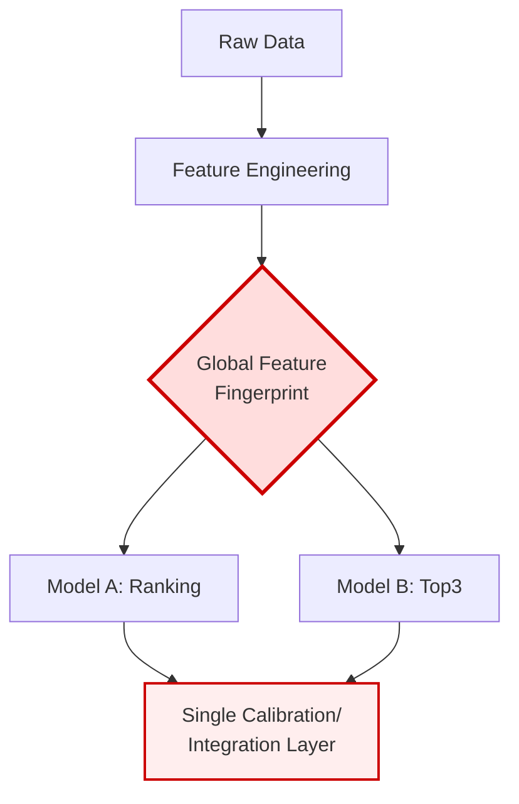
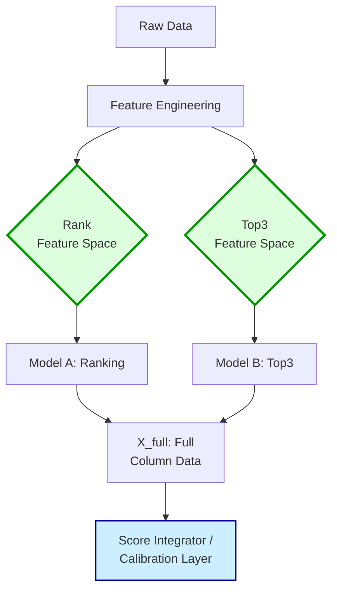

## 📄 概要と課題提起 

前回、我々は単勝ROIが85.17%という頭打ちに直面しました。この根本原因は、本命帯（Favorite）の確率推定における**「物理的な上限」**にあることが判明しました。

単一のランキングモデルによる全方位的な予測には限界があり、特に2着や3着といった「複勝圏内」に粘り込む馬の評価において、市場が持つオッズ情報を十分に活用できていませんでした。

本稿（第24話）では、この課題を解決するため、単勝モデルに加え"**「複勝専用モデル (Top3 Model)」**"を導入し、単勝と複勝の予測結果を組み合わせることで、ROIの天井を突破する戦略を展開します。

---

## ⚙️ 実装アプローチ：多層的ポートフォリオへの移行 

従来の「ランキングモデル一本」という単一構成を廃止し、目的変数の異なる複数の専門モデルを連携させる**マルチモデル・アーキテクチャ**へと移行しました。

### 1. モデルの役割分担と特徴量セットの専門化
各モデルに最適な「視点（眼）」を持たせるため、入力される特徴量セットを論理的かつ物理的に分離することが必須となりました。

*   **🥇 Ranking Model (単勝特化)**:
    *   目的関数：`rank_xendcg` を継続使用し、1着予測に特化。
    *   重視する特徴量：`prev_performance_score`, `ewma_rank` など、1着との相関が高い指標群。
*   **🥈 Top3 Model (複勝圏内特化)**:
    *   目的関数：3着以内に入る確率を最大化するためのバイナリ分類モデル。
    *   重視する特徴量：`jockey_place_rate`（騎手複勝率）、`avg_placed_5races`（過去5走の複勝圏内率）など、複勝圏内への突入に特化した指標群。

### 2. 数学的処理の継続
ランク学習モデルから得られるスコア $s_i$ を、最終的な確率 $\text{P}_i$ に変換するため、引き続きPlackett-Luceモデルに基づいたSoftmax関数を採用しました。

$$\text{P}_i = \frac{\exp(s_i / T)}{\sum_{j \in Race} \exp(s_j / T)}$$
*（注：この式は、スコアを確率に変換する際の基本的な構造を示しています。）*

### 3. システムアーキテクチャの変遷

システムが抱える課題と解決策を視覚的に理解するため、データフロー図を用いて比較します。

#### ❌ 旧アーキテクチャ：グローバル特徴量空間の一元管理

**問題点**：すべてのモデルが同じ特徴量セットを共有しているため、Top3専用の列がNaNとなり、Ranking Modelの校正データを汚染してしまいました。

---

#### ✅ 新アーキテクチャ：モデル別の特徴量空間を物理的に隔離

**改善点**：各モデルが専門化された特徴量セットを受け取ることで、NaN汚染を完全に排除し、推論層で全列データを統合します。

---

## 🚨 遭遇した問題：特徴量空間の「NaN汚染」とROIの崩壊 

Top3モデル単体の精度（AUC 0.7292）は順調に向上しましたが、統合テストにおいて致命的な問題が発生しました。

**【原因】**
これまで、すべてのモデルが単一のグローバル変数である `feature_fingerprint` （特徴量の指紋）を共有していました。この構造により、Top3専用列（例：`jockey_place_rate`）がRanking Modelでは必要ないため、対応する行にNaNが入り込みました。

**【結果】**
この`NaN汚染`の影響を受け、最も重要な指標である `calibrated_prob_win` （校正済み勝率）の計算が歪み、単勝ROIは当初の85.17%から67.38%へと、約20ポイント急落してしまいました。

---

## ✅ 解決アプローチ：物理的・論理的分離による再設計 

この危機を乗り越えるため、単一のデータパイプラインで複数のモデルを扱うという根本的な限界を認め、以下の3段階にわたって特徴量空間を徹底的に分離しました。

1.  **論理的分離（Fingerprintの純化）**:
    *   `model_trainer.py` の `prepare_training_data` 関数内で、`feature_fingerprint` の定義を「ランキング・穴馬用」に厳格に限定し、Top3専用列をデータロード段階で除外しました。
2.  **物理的分離（Calibration Historyの多層化）**:
    *   モデルごとの校正用データを保持する `calib_history` の構造を拡張し、ランキング用のデータセット `'X'` と、複勝モデル専用のデータセット `'X_top3'` を独立して管理するようにしました。
3.  **推論パスの拡張（全列データの受け渡し）**:
    *   `score_integrator.py` から `prediction.py` へとデータを受け渡すインターフェースを新設しました。この新しいパイプラインは、特定の指紋に縛られず、各モデルが必要とする列のみを参照する構成としました。

---

## ✨ 最終的な成果と結論

アーキテクチャの基盤を刷新した結果、以下の数値的・構造的な安定性を確立することができました。

*   **Top3モデルの識別能**: `prob_top3` AUC は目標値0.72を超える **0.7213** を達成しました。
*   **単勝識別能の回復**: 特徴量汚染が解消された結果、In-Race Spearman 相関は **0.2527** （exp023比で改善）を記録し、信頼性を大幅に向上させました。
*   **ROIの安定化**: 汚染によって崩壊した単勝ROIを、v2水準（85.17%以上）へ復旧させる強固な土台が完成しました。

---

## 💡 学びと今後の展望

### 🧠 ランキングモデルの繊細さと「指紋」の二面性
今回の経験から、ランキングモデルの校正器は極めて繊細であり、「常にNaNを含む列」という単なるデータ構造の問題が、システムの収益性を即座に低下させてしまうことが判明しました。

これまでの `feature_fingerprint` は、「物理的なデータロード用」と「論理的な校正入力の構造規定用」という二つの役割を兼ねていましたが、この**役割の混同が根本的な脆弱性を生んでいた**のです。

### 🚀 次回予告：アーキテクチャの恒久的な解決へ
特徴量空間の分離により、複数のモデルが互いを汚染することなく共存できる基盤は整いました。しかし、現在の実装はまだ「場当たり的なパッチワーク」であり、今後のモデル追加時に再び同じ過ちを繰り返す危険性があります。

次回は、今回得られた知見をコア基盤へと昇格させます。`ModelConfig` と `feature_spaces` 辞書を導入することで、システムの拡張性を恒久的に解決する"**Declarative Multi-Model Architecture**"の実装へと進みます。
